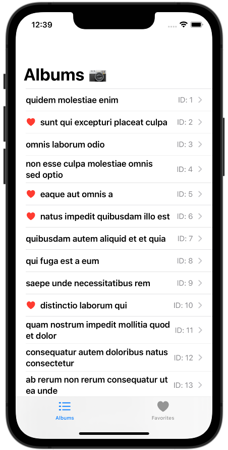
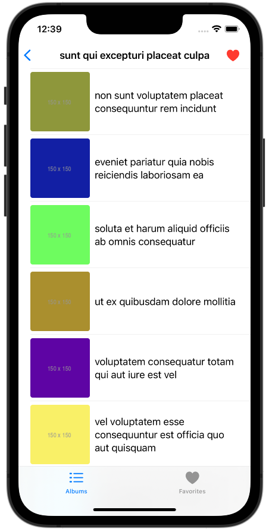
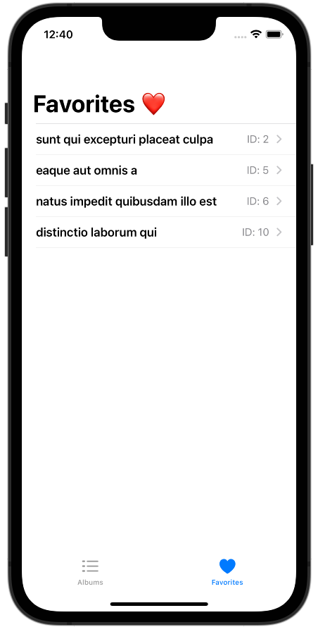

# PhotoAlbums

This is a project I recently completed as part of the interview process for an iOS Developer role. The app displays a list of photo albums and allows see the photos in each album in a separate list. It's also possible to mark an album as a favorite and it persists locally.

The project uses SwiftUI, MVVM, async/await, Codable, CoreData, and the [JSONPlaceholder albums API](https://jsonplaceholder.typicode.com).

## Screenshots

&nbsp;&nbsp;&nbsp;&nbsp;
&nbsp;&nbsp;&nbsp;&nbsp;

